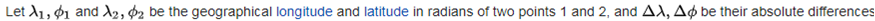
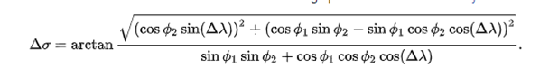
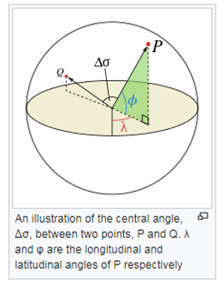

You are provided a list of cities and their latitude and longitudes as data for your program.
These are in latlong.csv
The file is comma-delimited, its first row is headers
The columns are:
City, Latitude, Longitude, State/Province, Country
This template project includes code to load the data for you.

Write code that accepts a list of city names and using the provided formulas and city lat long data returns the two cities that are closest together.
The classes <code>DistanceService.cpp</code> and <code>VincentyService.cpp</code> are provided as templates to use, add your implemention in the //TODOs.  
Feel free to create additional classes and methods if you require.

1.  latitudinal and longitudal coordinates are in degrees, convert these to radians with  L * &pi; / 180
2.  Use the Vincenty formula to calculate the distance:
 
 
 
 N.B.: &phi; is latitude and &lambda; is longitude!
 
 
  
visualizing this:

 

3.  It is an error if, for example, a provided city name does not exist in the lat long list.
    then throw an exception. this is not the only possible error.

4.  You may need to make some assumptions, try to make these explicit.

5.  If you can write unit tests please include them in your submission!  

You can download a community or trial edition of Visual Studio from [https://visualstudio.microsoft.com/downloads/] 

